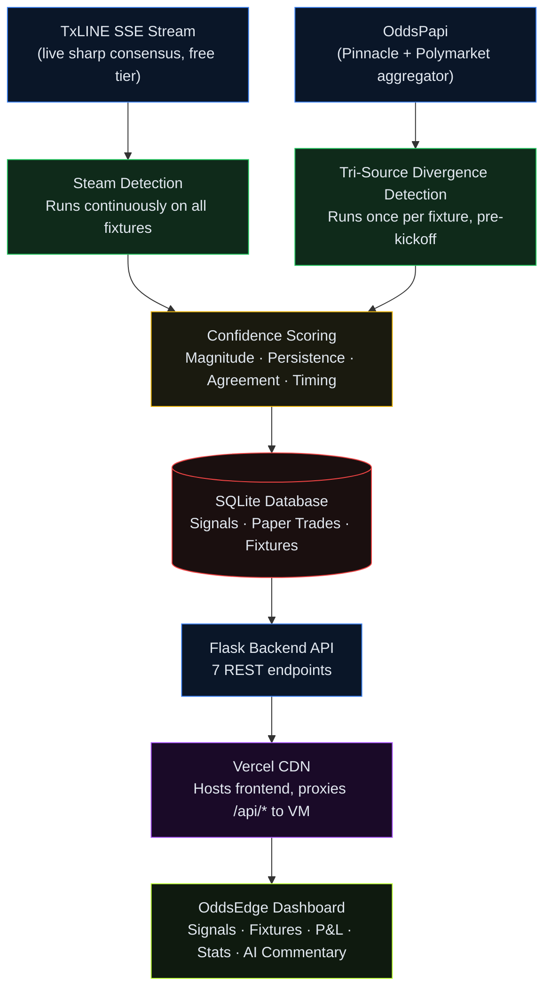

# OddsEdge — Sharp Money Detector

A fully autonomous signal detection agent built for the Superteam World Cup Hackathon (Track 03: Trading Tools and Agents). It monitors three independent market sources in real time, detects sharp money movement across World Cup 2026 fixtures, scores every signal for accuracy, and surfaces everything on a live public dashboard.

**Live dashboard:** [https://odds-edge-iota.vercel.app](https://odds-edge-iota.vercel.app)

---

## Demo

[](https://youtu.be/5L3sLmPqKsM)

---

## Quick links

| | |
|---|---|
| 🎬 **Demo video** | [https://youtu.be/5L3sLmPqKsM](https://youtu.be/5L3sLmPqKsM) |
| 🌐 **Live dashboard** | [https://odds-edge-iota.vercel.app](https://odds-edge-iota.vercel.app) |
| 📊 **Audit data** | [Download full signal and trade history (CSV)](https://1drv.ms/x/c/ce83468980fa23c5/IQChsACYtsWJRruPUo38b4_rATD8tE4hE8O4IQX8YU_9f0A?e=C9qnBC) |

A complete CSV export of all signals and settled paper trades is available at the link above for off-line verification.

---

## What it does

Most sharp money detectors watch a single bookmaker and call any price movement a signal. The problem is that one source cannot tell you whether the movement reflects genuine informed action or just a bookmaker adjusting their own position. OddsEdge solves this by watching three genuinely independent sources simultaneously and looking for disagreement between them.

**Steam detection** — TxLINE's live SSE feed delivers the sharp consensus price (already de-vigged) for every World Cup fixture continuously. When that price moves more than 5% in the same direction across at least 3 consecutive ticks, the agent logs a STEAM signal. The persistence requirement filters out noise: a single spike that reverses is not sharp money. A sustained move is.

**Tri-source divergence** — In the 2-3 hours before kickoff, when pre-match lines are most settled and comparable, the agent makes a single API call to OddsPapi to pull Pinnacle's raw decimal odds and Polymarket's exchange probability for the same fixture. TxLINE is already in memory from the stream. When any two of the three sources disagree by more than 5 percentage points on the same outcome, the agent logs a TRI_SOURCE_DIVERGENCE signal and identifies which source is the outlier. That outlier is the one pricing the outcome differently from the informed consensus.

**Why these three sources specifically:**
- TxLINE StablePrice is a de-vigged sharp consensus, not a raw bookmaker line
- Pinnacle is the sharpest traditional bookmaker in the world, the reference point professionals use
- Polymarket is a real-money prediction market where participants bet on outcomes directly, with no bookmaker margin involved

Getting all three to agree is a strong signal. Getting them to disagree is a stronger one.

---

## Architecture



The frontend is hosted on Vercel's CDN and the backend agent runs on a cloud VM 24/7, processing the live stream and updating the database continuously. All `/api/*` requests from the Vercel frontend are proxied server-side to the VM, so the browser only ever talks HTTPS.

---

## Signal detection logic

### Steam detection

```
For each (fixture_id, market_type) pair tracked by the stream:

  On each new tick from TxLINE:
    pct_change = (new_price - previous_price) / previous_price * 100
    if abs(pct_change) >= 5.0%:
      persistence = count of consecutive prior ticks in the same direction
      if persistence >= 3:
        log STEAM signal
```

The 5% threshold and 3-tick persistence were tuned against real data observed during the tournament. A single large move that reverses is not logged. The persistence requirement means the agent waits for confirmation before writing anything to the database.

### Tri-source divergence

```
For each fixture, 2-3 hours before kickoff:

  txline_prob  = Pct field from TxLINE snapshot (already de-vigged, sums to ~100)
  pinnacle_prob = de-vigged manually:
                  implied_raw[i] = 1 / decimal_odds[i]
                  overround = sum(implied_raw)
                  fair_prob[i] = implied_raw[i] / overround
  polymarket_prob = exchangeMeta.back[0].cents * 100
                    (direct market probability, no de-vigging needed)

  For each outcome:
    divergence = max(values) - min(values)
    if divergence >= 5.0%:
      identify the outlier (source furthest from the other two)
      log TRI_SOURCE_DIVERGENCE signal
```

The de-vigging step on Pinnacle is necessary because raw bookmaker odds include margin. TxLINE's StablePrice is already de-vigged. Comparing them directly without removing the overround would produce false divergence. Polymarket is a prediction market exchange where prices are already implied probabilities, so no de-vigging is applied.

### Confidence scoring

Every signal is assigned a score from 0 to 1 using a weighted formula:

```
magnitude_score    = min(movement_or_divergence_pct / 15.0, 1.0)
persistence_score  = min(persistence_ticks / 10.0, 1.0)
agreement_score    = sources_agreeing_on_direction / 3     (1.0 for pure STEAM)
timing_score       = 1.0 if pre-match
                     0.6 if match_minute < 60
                     0.3 otherwise

confidence = (magnitude_score  * 0.35)
           + (persistence_score * 0.25)
           + (agreement_score   * 0.25)
           + (timing_score      * 0.15)
```

Magnitude is weighted highest because a large, confirmed price move is the primary definition of sharp action. Persistence comes second because sustained moves are more meaningful than sudden ones. Source agreement and timing adjust the score based on how many independent readings confirm the direction and how close to kickoff the signal appeared.

### Paper trading and auto-scoring

Every signal triggers a simulated flat-stake bet of 100 units at the TxLINE sharp price. The agent polls for match results every 60 seconds using TxLINE's historical scores endpoint. When a `game_finalised` action is detected, the final score is read, the signal is marked CORRECT or INCORRECT, and the paper trade is settled automatically. No manual intervention at any point.

---

## Project structure

```
sharp-detector/
  agent/
    config.py          detection thresholds and global constants
    database.py        SQLite persistence layer (all reads and writes)
    detector.py        SteamDetector class — tick processing and signal firing
    stream.py          TxLINE SSE consumer — connects, reconnects, feeds detector
    txline.py          TxLINE auth and REST helpers
    oddspapi.py        OddsPapi integration with per-call budget logging
    commentary.py      Gemini AI commentary generation (on-demand)
  backend/
    app.py             Flask API — 7 REST endpoints
  frontend/
    index.html         Single-file dashboard (vanilla HTML/CSS/JS, Chart.js via CDN)
    docs.html          Technical documentation page
    vercel.json        Vercel proxy rewrite rule
  run_agent.py         Entry point — starts stream and result-checking loop together
  requirements.txt     Python dependencies
  sharp_detector.db    SQLite database (gitignored)
  tokens.json          TxLINE and Gemini credentials (gitignored)
```

---

## API routes

| Route | Method | Description |
|---|---|---|
| `/api/signals` | GET | All signals, newest first. Supports `?limit=` and `?offset=` |
| `/api/signals/live` | GET | Signals from currently in-play fixtures only |
| `/api/signals/<fixture_id>` | GET | All signals for a single fixture |
| `/api/signals/<id>/commentary` | POST | Generate or return cached Gemini AI commentary |
| `/api/pnl` | GET | Cumulative P&L time series for the equity curve |
| `/api/stats` | GET | Overall accuracy %, high-confidence accuracy %, total signals |
| `/api/fixtures` | GET | All tracked fixtures with status and final result |


---

## Data sources

| Source | What it provides | Access model |
|---|---|---|
| TxLINE SSE stream | De-vigged sharp consensus prices, live updates | Unlimited, free tier (60s delay, World Cup + International Friendlies) |
| TxLINE scores feed | Live and historical match scores, `game_finalised` events | Same credentials as odds stream |
| OddsPapi | Pinnacle and Polymarket odds for the same fixtures | One call per fixture, timed 2-3 hours before kickoff |

The tri-source call is made in the pre-match window when lines are most settled and comparable across all three sources. One call per fixture gives the cleanest snapshot for divergence detection.

---

## Local setup

**Requirements:** Python 3.11+, pip

```bash
git clone https://github.com/Phonicxxxx24/ODDS_EDGE.git
cd ODDS_EDGE/sharp-detector
pip install -r requirements.txt
```

Create `tokens.json` at the project root:

```json
{
  "jwt": "your_txline_jwt",
  "apiToken": "your_txline_api_token",
  "gemini_key": "your_gemini_api_key"
  "oddspapi_key": "your_oddspapi_key",  
}
```

Alternatively, set `GEMINI_API_KEY` as an environment variable.

Initialize the database and start the backend:

```bash
python -c "from agent.database import init_db; init_db()"
python run_agent.py
```

In a second terminal:

```bash
python -m flask --app backend/app.py run --port 5000
```

Open `http://localhost:5000` in a browser.

---

## Confidence thresholds reference

| Parameter | Value | Meaning |
|---|---|---|
| `MOVEMENT_THRESHOLD_PCT` | 5.0 | Minimum % price move to start tracking a steam signal |
| `PERSISTENCE_MIN_TICKS` | 3 | Consecutive same-direction ticks required before logging |
| `DIVERGENCE_THRESHOLD_PCT` | 5.0 | Minimum % spread between sources to log a divergence signal |
| `STAKE_PER_BET` | 100 | Flat paper trading stake per signal |

| `RESULT_CHECK_INTERVAL_SEC` | 60 | How often the agent polls for match results |
| `RECONNECT_DELAY_SEC` | 5 | Seconds to wait before reconnecting the SSE stream |

---

## Built with

- Python 3.11
- Flask 3.0 with flask-cors
- SQLite (WAL mode, concurrent reads)
- TxLINE (SSE stream + scores feed)
- OddsPapi (Pinnacle + Polymarket aggregator)
- Google Gemini 2.0 Flash (AI commentary)
- Chart.js (equity curve)
- Vercel (frontend CDN + API proxy)
- Azure VM + nginx (backend host)

---

## Hackathon context

Built for Superteam World Cup Hackathon, Track 03: Trading Tools and Agents. Deadline July 19, 2026. Solo build.

The core differentiator is the tri-source approach. Existing sharp money detection tools typically compare one sharp bookmaker against the market average. This project combines TxLINE's de-vigged consensus, Pinnacle's independently de-vigged lines, and Polymarket's raw prediction market probability. When all three disagree, it points to genuine pricing inefficiency rather than a single bookmaker's adjustment.
